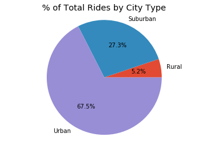

## Analysis
```
1. Urban areas have the highest number of rides and drivers
2. While Rural areas have the least number of rides, they have the highest average fare cost
3. Even though urban areas have higher average fare costs, urban areas still responsible for
    the majority of fare revenue generated
```


```python
import os
import pandas as pd
import matplotlib.pyplot as plt
import numpy as np


city_csvpath = os.path.join('raw_data', 'city_data.csv')
ride_csvpath = os.path.join('raw_data', 'ride_data.csv')

city_df = pd.read_csv(city_csvpath)
ride_df = pd.read_csv(ride_csvpath)

city_ride_df = ride_df.merge(city_df, on='city')
city_ride_df.head(3)
```


<div>
<style>
    .dataframe thead tr:only-child th {
        text-align: right;
    }

    .dataframe thead th {
        text-align: left;
    }

    .dataframe tbody tr th {
        vertical-align: top;
    }
</style>
<table border="1" class="dataframe">
  <thead>
    <tr style="text-align: right;">
      <th></th>
      <th>city</th>
      <th>date</th>
      <th>fare</th>
      <th>ride_id</th>
      <th>driver_count</th>
      <th>type</th>
    </tr>
  </thead>
  <tbody>
    <tr>
      <th>0</th>
      <td>Sarabury</td>
      <td>2016-01-16 13:49:27</td>
      <td>38.35</td>
      <td>5403689035038</td>
      <td>46</td>
      <td>Urban</td>
    </tr>
    <tr>
      <th>1</th>
      <td>Sarabury</td>
      <td>2016-07-23 07:42:44</td>
      <td>21.76</td>
      <td>7546681945283</td>
      <td>46</td>
      <td>Urban</td>
    </tr>
    <tr>
      <th>2</th>
      <td>Sarabury</td>
      <td>2016-04-02 04:32:25</td>
      <td>38.03</td>
      <td>4932495851866</td>
      <td>46</td>
      <td>Urban</td>
    </tr>
  </tbody>
</table>
</div>


```python
## Average Fare ($) Per City
city_grouby = city_ride_df.groupby('city')
average_fare_df = city_grouby.mean()
average_fare_df = average_fare_df[['fare']]

## Total Number of Rides Per City
city_grouby = city_ride_df.groupby('city')
total_rides = city_grouby.size()
total_rides.name = 'Total Rides'
total_rides_df = pd.DataFrame(total_rides)

# Total Number of Drivers Per City
scatter_plot_df = city_df[['city', 'driver_count', 'type']]

# merge the three objects
scatter_plot_df = scatter_plot_df.merge(average_fare_df, left_on='city', right_index=True)
scatter_plot_df = scatter_plot_df.merge(total_rides_df, left_on='city', right_index=True)
scatter_plot_df.head(3)
```


<div>
<style>
    .dataframe thead tr:only-child th {
        text-align: right;
    }

    .dataframe thead th {
        text-align: left;
    }

    .dataframe tbody tr th {
        vertical-align: top;
    }
</style>
<table border="1" class="dataframe">
  <thead>
    <tr style="text-align: right;">
      <th></th>
      <th>city</th>
      <th>driver_count</th>
      <th>type</th>
      <th>fare</th>
      <th>Total Rides</th>
    </tr>
  </thead>
  <tbody>
    <tr>
      <th>0</th>
      <td>Kelseyland</td>
      <td>63</td>
      <td>Urban</td>
      <td>21.806429</td>
      <td>28</td>
    </tr>
    <tr>
      <th>1</th>
      <td>Nguyenbury</td>
      <td>8</td>
      <td>Urban</td>
      <td>25.899615</td>
      <td>26</td>
    </tr>
    <tr>
      <th>2</th>
      <td>East Douglas</td>
      <td>12</td>
      <td>Urban</td>
      <td>26.169091</td>
      <td>22</td>
    </tr>
  </tbody>
</table>
</div>


## Build Bubble Plot that showcases the relationship between:
```
Average Fare ($) Per City
Total Number of Rides Per City
Total Number of Drivers Per City
City Type (Urban, Suburban, Rural)
```


```python
types = ['Urban', 'Suburban', 'Rural']
colors = ['red', 'gold', 'blue']
plt.style.use('ggplot')

for i in range(0, len(types)):
    city_type = types[i]
    color = colors[i]
    df = scatter_plot_df[scatter_plot_df['type'] == city_type]
    ## Filter out an outlier identified during initial plotting
    df = df[df['Total Rides'] < 60]
    plt.scatter(df['Total Rides'], df['fare'],
                s=df['driver_count'], alpha=.7,
                 edgecolor='black', c=color, label=city_type)
plt.legend(title='City Types')
```


    <matplotlib.legend.Legend at 0x208556575f8>


## Add Chart elements
```
Chart title
Axes titles
Key
Note about circle size
```


```python
title = 'Pyber Ride Sharing Data (2016)'
x_axis_label = 'Total Number of Rides (Per City)'
y_axis_label = 'Average Fare ($)'
note = 'Note: Circle size correlates to driver count'

plt.title(title)
plt.xlabel(x_axis_label)
plt.ylabel(y_axis_label)
plt.text(15,37,note)
```


    <matplotlib.text.Text at 0x2085560d2b0>


```python
plt.show()
```


## Total Fares by City Type

```% of Total Fares by City Type```


```python
title = '% of Total Fares by City Type'
plt.style.use('ggplot')
type_grouby = city_ride_df.groupby('type')
total_fare_df = type_grouby.sum()
total_fare_df = total_fare_df[['fare']]
total_fare_df.plot.pie(subplots=True, legend=False, autopct='%1.1f%%')
plt.xlabel('')
plt.ylabel('')
plt.title(title)
plt.axis('equal')
plt.show()
```


```% of Total Rides by City Type```


```python
title = '% of Total Rides by City Type'
plt.style.use('ggplot')
type_grouby = city_ride_df.groupby('type')
total_rides_series = type_grouby.size()
total_rides_series.plot.pie(subplots=True, legend=False, autopct='%1.1f%%')
plt.xlabel('')
plt.ylabel('')
plt.title(title)
plt.axis('equal')
plt.show()
```





```% of Total Drivers by City Type```


```python

title = '% of Total Drivers by City Type'
plt.style.use('ggplot')
type_grouby = city_ride_df.groupby('type')
total_drivers_df = type_grouby.sum()
total_drivers_df = total_drivers_df[['driver_count']]
total_drivers_df.plot.pie(subplots=True, legend=False, autopct='%1.1f%%')
plt.xlabel('')
plt.ylabel('')
plt.title(title)
plt.axis('equal')
plt.show()
```


